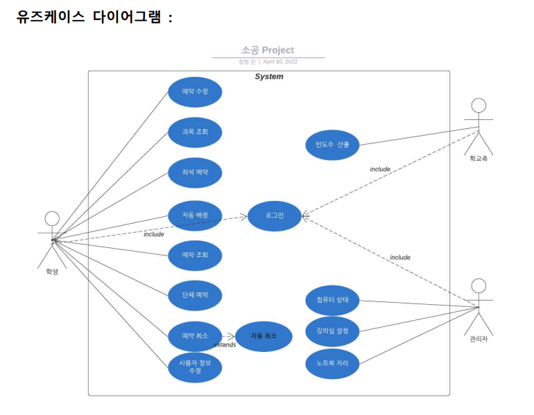
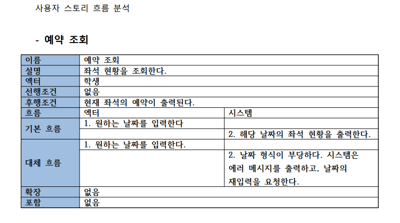

# Software Engineering Project

강의실 자리 예약 시스템 개발 프로젝트

## Introduction

코로나 시국에 통학을 하는 학생들을 위해 거리두기 앉기, 실습실 컴퓨터 부팅 여부, 노트북 사용 자리 표시 등 사회적으로 필요한 기능을 제공하는 강의실 자리 예약 시스템을 개발한다. 이것을 소프트웨어 공학 수업에서 배운 스크럼 모델을 활용하여 프로젝트를 구성하는 법과 팀원들끼리 협업하는 능력을 키운다.


## ✨ Demo

### login
<p align ="center">
  
</p>

### reserve
<p align ="center">
  
</p>

### myPage
<p align ="center">
  
</p>

## Project Structure
```

web
├── Lectures.jsp
├── MyInfo.jsp
├── index.jsp
├── joinAction.jsp
├── login.jsp
├── loginAction.jsp
├── reservation.jsp
├── bat
├── css
├── images
├── js

```

- *.jsp
웹 화면 구성에 필요한 jsp 파일
  
  - Lectures : 강의 목록 전시 페이지
  - MyInfo : 마이페이지
  - joinAction : 회원가입 데이터 렌더링
  - login : 로그인 페이지
  - loginAction : 회원 정보 렌더링
  - reservation : 강의실 좌석 예약 페이지
  
- bat/ css/ images/ js
웹페이지 구성에 필요한 리소스를 모아놓은 폴더
  

## Files
- 프로젝트 계획서.pdf
- 요구사항 분석.pdf : usecase diagram, domain model, user story 흐름도

#### 1. usecase diagram



#### 2. domain model


#### 3. user story



## Features
1. 로그인
- consolelog 기능
2. 강의 정보
- 강의 목록 확인
- 강의 계획서 출력
3. 예약 
- 좌석 예약
- 예약 조회
- 예약 취소
      


## Issue

* [X] 톰캣 연동시에 에러 메세지가 출력되는 현상
* [X] 프로젝트 환경 구성 시에 로컬만 적용되고 원격에는 반영되지 않는 현상 
* [X] maria DB 연동 시 이전에 했던 프로젝트 데이터가 불러와지는 현상
* [X] DB 연동시 platform independent를 맞추지 않아 연결되지 않는 현상
* [X] 마이페이지에 이전 사용자의 정보가 들어가 있는 현상


<!--
## Prerequisites
Before you begin, ensure you have met the following requirements:
// These are just example requirements. Add, duplicate or remove as required
* You have installed the latest version of `<coding_language/dependency/requirement_1>`
* You have a `<Windows/Linux/Mac>` machine. State which OS is supported/which is not.
* You have read `<guide/link/documentation_related_to_project>`.
-->

<!--
## Release History

* 0.2.1
    * CHANGE: Update docs (module code remains unchanged)
* 0.2.0
    * CHANGE: Remove `setDefaultXYZ()`
    * ADD: Add `init()`
* 0.1.1
    * FIX: Crash when calling `baz()` (Thanks @GenerousContributorName!)
* 0.1.0
    * The first proper release
    * CHANGE: Rename `foo()` to `bar()`
* 0.0.1
    * Work in progress
-->


<!--
## 🚀 Usage

클론

```bash
  git clone https://github.com/SangBoem-Hahn/Pokemon
```
-->


## Feedback
- 테스트 도구의 활용이 기본에 충실했다. 더욱 다양한 기능을 사용해 봐라
- 깃허브 브랜치 네트워크 모양이 특정 몇 명에게 치우쳐져있다. 참여하지 않은 팀원들도 문제지만 관리하지 못한 팀장의 문제이다.
- 데일리 미팅 진행 과정을 산출물로 남겼으면 좋았을 것이다.
- 통합 테스팅을 마지막에만 하였는데 글면 안된다. 통합 테스팅은 매 스프린트가 끝날 때 해야한다. ex) 총 3개의 스프린트라면 3번 했어야 했다.
- 로컬 환경이 아닌 AWS 배포까지 생각해 봐라
- 회사에서는 main, feature 브랜치 사이에 develop 브랜치를 둔다.
- 좌석 정보를 실제 강의 사이트에서 크롤링하여 반영하였으면 더 좋았을 것이다.


## Author

👤 **SangBoem-Hahn**

- Github: [@SangBoem-Hahn](https://github.com/SangBoem-Hahn)
- Blog : [Tistory](https://hsb422.tistory.com/)
---
